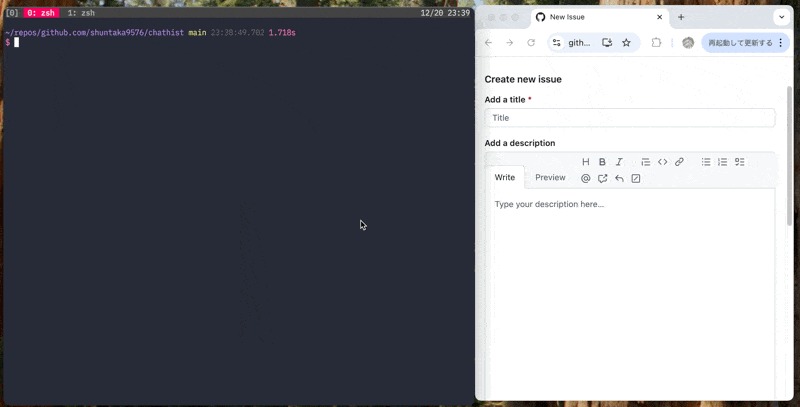

# chathist

A lightweight CLI tool to view and export your AI coding agent's chat history—currently optimized for Claude Code.

Built for speed and flexibility, chathist hooks into fzf / fzf-tmux to let you breeze through past sessions with instant previews. It’s fully customizable via Lua configuration and Jinja2 templates, so you can tailor the output to your exact workflow.



## Installation

### Brew (MacOS)

```bash
brew install shuntaka9576/tap/chathist
```

### Cargo (git)
```bash
git clone https://github.com/shuntaka9576/chathist
cd chathist
cargo install --path .
```

## Getting Started

`chathist` is designed to pair perfectly with `fzf`.

`chathist list` appends normalized conversation text as an extra tab-separated field, so you can search by message body with `fzf` while keeping the session ID in the first column for previews and selection.

### Zsh Integration

Add this to your `.zshrc` to get a unified session picker on `Ctrl+H`.

**Session picker keybindings (inside fzf)**

| Key | Action |
|-----|--------|
| `Tab` | Multi-select sessions |
| `Shift+Up/Down` | Scroll preview |
| `Ctrl+S` | Switch to cross-worktree mode |
| `Ctrl+D` | Switch back to current project |

After selecting sessions, you choose an action.

| Action | Description |
|--------|-------------|
| `resume` | Resume the session in Claude Code (`claude --resume`) |
| `open` | Open in editor with a template |

```bash
function chathist-widget() {
  local selection=$(chathist list | fzf-tmux --multi \
    --delimiter=$'\t' \
    --with-nth=2.. \
    --header 'ctrl-s: cross-worktree / ctrl-d: current project' \
    --preview 'chathist pick {1} --stdout' \
    --preview-window 'right:45%:wrap' \
    --bind 'ctrl-s:reload(chathist list -w)+change-preview(chathist pick -w {1} --stdout)+change-header(cross-worktree | ctrl-d: current project)' \
    --bind 'ctrl-d:reload(chathist list)+change-preview(chathist pick {1} --stdout)+change-header(current project | ctrl-s: cross-worktree)' \
    | cut -f1)

  [ -z "$selection" ] && { zle reset-prompt; return; }

  local action=$(printf 'resume\nopen' | fzf-tmux --prompt="Action: ")
  [ -z "$action" ] && { zle reset-prompt; return; }

  case "$action" in
    resume)
      local session_id=$(echo "$selection" | head -1)
      chathist insert -w "$session_id" 2>/dev/null
      BUFFER="claude --resume $session_id"
      zle accept-line
      return
      ;;
    open)
      local template=$(chathist pick --list-templates | fzf-tmux --prompt="Template: ")
      [ -z "$template" ] && { zle reset-prompt; return; }
      echo "$selection" | chathist pick -w -t "$template"
      ;;
  esac

  zle reset-prompt
}

zle -N chathist-widget
bindkey "^h" chathist-widget
```

### Core Commands

* `chathist list`: List all chat sessions.
* `chathist list -w`: List sessions across all worktrees of the same repository.
* `chathist pick <session_id>`: Opens the specified session in the editor.
* `chathist pick --stdout <session_id>`: Dump content to terminal (ideal for `fzf` previews).
* `chathist pick --template <name> <session_id>`: Use a predefined template.
* `chathist pick --list-templates`: List available template names (for fzf integration).
* `chathist pick -w <session_id>`: Pick from any worktree of the same repository.
* `chathist insert -w <session_id>`: Copy a session from another worktree into the current project's log directory (enables `claude --resume`).

## Configuration

Chathist looks for its configuration file at `~/.config/chathist/config.lua` by default. Run `chathist config` to open the file. If you want to use a different location, set the `CHATHIST_CONFIG_FILE_PATH` environment variable.

* The app looks for an editor in this order: config.editor, $EDITOR, then vim.
* Claude logs default to the following directories: $CLAUDE_CONFIG_DIR/projects/ or ~/.claude/projects/.

The Lua table below outlines the internal defaults. To customize your setup, simply override these values in your `config.lua`.

```lua
local chathist = require("chathist")

return {
  -- editor = "vim",  -- Uses $EDITOR or vim if not set
  commands = {
    list = {
      template = "$session_id\t$title:50\t$relative_time:>15\t$message_count:>5",
    },
    pick = {
      template = {
        preset = {
          standard = chathist.template.pick.standard,
          github = chathist.template.pick.github,
          ["github-compact"] = chathist.template.pick.github_compact,
          slack = chathist.template.pick.slack,
        },
        default = "standard",
        -- list_hidden = { "github-compact" },  -- Hide from --list-templates output
      },
    },
  },
}
```

### commands.list

Customize output by setting `commands.list.template` in your config.

#### Syntax

| Format | Description |
|--------|-------------|
| `$var` | Expand variable |
| `$var:N` | Expand with width N (left-aligned, truncated if longer) |
| `$var:>N` | Expand with width N (right-aligned) |

#### Available Variables

| Variable | Description |
|----------|-------------|
| `$session_id` | Session ID |
| `$title` | Session title (first message or summary) |
| `$time` | Timestamp |
| `$relative_time` | Relative time (e.g., "2 hours ago") |
| `$message_count` | Number of messages in the session |
| `$branch` | Git branch |

### commands.pick

Templates use Jinja2 syntax (via minijinja). Customize output by setting `commands.pick.template` in your config.

#### Available Variables

| Variable | Description |
|----------|-------------|
| `sessions` | Array of sessions |
| `sessions[].id` | Session ID |
| `sessions[].messages` | Array of messages |
| `sessions[].messages[].role` | `"user"` or `"assistant"` |
| `sessions[].messages[].content` | Message content |
| `sessions[].plan` | Plan content (if exists) |


#### Available Filters

| Filter | Description |
|--------|-------------|
| `title` | Capitalize first letter (e.g., `"user"` → `"User"`) |
| `truncate(length=N)` | Truncate string with `...` suffix |
| `replace` | String replacement |

#### Template Examples

| Template | Description |
|----------|-------------|
| [standard](src/config/templates/pick/standard.j2) | Plain Markdown |
| [github](src/config/templates/pick/github.j2) | Markdown wrapped in `<details>` for GitHub |
| [github-compact](src/config/templates/pick/github_compact.j2) | Fully nested `<details>` for GitHub |
| [slack](src/config/templates/pick/slack.j2) | Slack mrkdwn format (paste directly into Slack) |

Use Jinja2 conditionals to filter messages by role.

```jinja2


## User

{{ message.content }}



```
